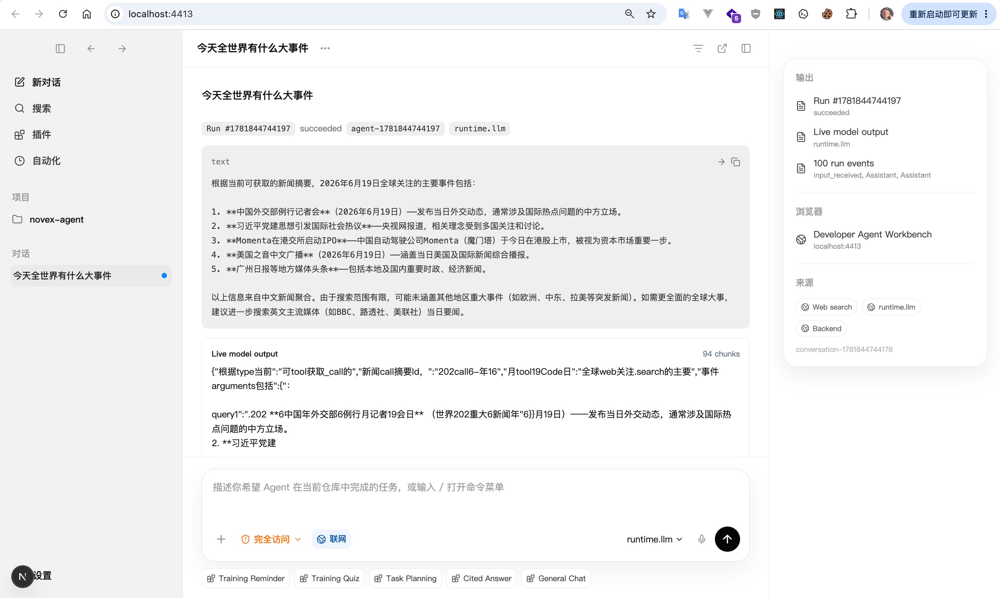
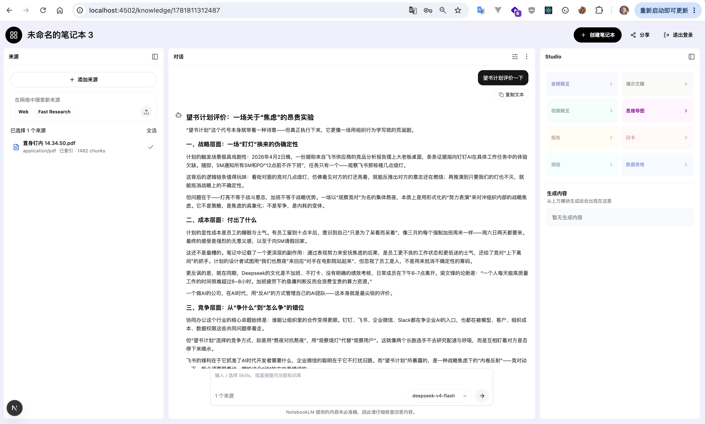
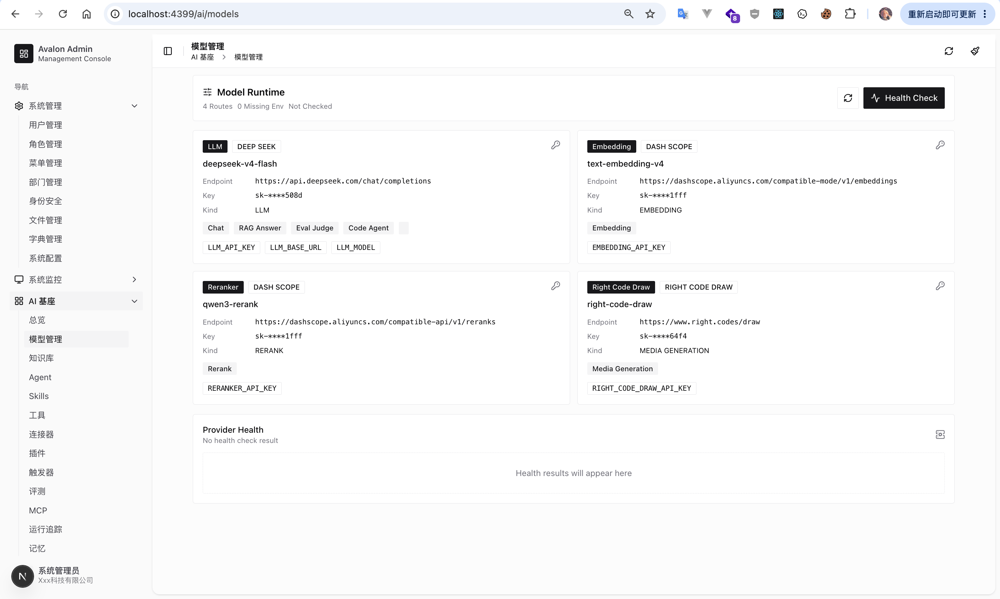
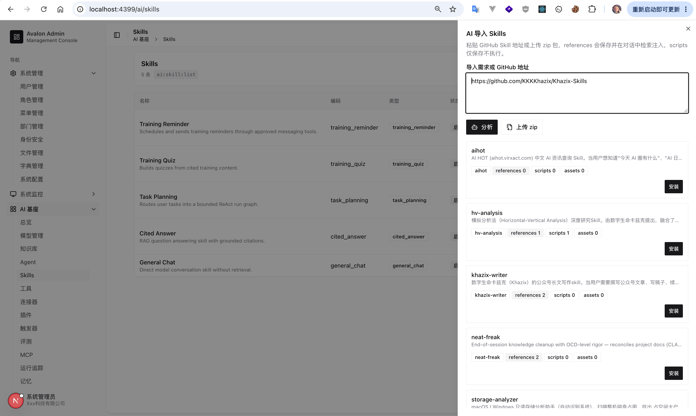

# Novex

Novex 是一套面向企业交付的 AI Agent 基座。它不是单点 AI 应用，而是把账号、租户、权限、知识库、模型路由、Agent 运行时、工具、MCP、连接器、记忆、评测、模板和交付流程沉淀成可复用平台能力，再按客户、行业和场景组合成具体应用。

当前仓库是一个 Rust first 的 monorepo：`backend` 负责控制平面、HTTP API 和业务编排，`crates/*` 承载可复用 AI Foundation 能力，`admin` 和 `apps/*` 提供管理后台与客户前台模板，`services/*` 作为 Python/模型 sidecar，`scripts`、`.env.example` 与 `templates` 支撑本地 POC 和客户交付。完整架构长文见 [docs/ARCHITECTURE.md](docs/ARCHITECTURE.md)，本 README 保持项目首页、模块地图和开发规范入口。

## 产品截图

<table>
  <tr>
    <td width="100%">
      
      <br />
      <sub>Codex-like Agent 工作台：联网搜索、模型输出和运行事件。</sub>
    </td>
  </tr>
  <tr>
    <td width="100%">
      
      <br />
      <sub>NotebookLM-like 知识工作区：资料、对话和内容生成。</sub>
    </td>
  </tr>
  <tr>
    <td width="100%">
      
      <br />
      <sub>AI 基座模型管理：模型路由、密钥占位和健康检查。</sub>
    </td>
  </tr>
  <tr>
    <td width="100%">
      
      <br />
      <sub>AI Skills 导入与管理：GitHub Skill 解析、预览和安装。</sub>
    </td>
  </tr>
</table>

## 当前能力

- 控制平面：认证、RBAC、数据权限、租户资源、用户/角色/菜单/部门、文件/对象存储、系统配置、密钥占位、身份提供商、审计日志、在线用户、调度任务和 API 兼容响应封装。
- AI Foundation：模型注册与路由、provider 调用、RAG、知识库、Agent run、Agent queue、turn item ledger、Run Graph、工具注册与执行、审批策略、MCP gateway、连接器、插件、trigger、memory、eval、trace 和成本/用量记录。
- 运行链路：backend、eval-worker、parser-worker、RabbitMQ outbox、Milvus 向量召回、Redis 协调、MinIO 文件资产、PostgreSQL 事实源和可选 model-runtime adapter。
- 前台应用：管理后台、员工培训、知识库问答、Agent 工作台、Codex-like POC、客服 Agent 交付模板。
- 交付体系：客户模板、默认菜单/权限、技能 manifest、评测集、smoke 脚本、POC 环境 schema 和交付文档。

## 快速启动

POC 默认复用外部 `docker-common` 基础设施。当前启动方式是：只有 PostgreSQL、Redis、RabbitMQ、Milvus、MinIO、Attu、Neo4j 这些共享基础设施在 Docker 里；Novex 自己的 backend、eval-worker、parser-worker 和所有前端 app 都用本机进程启动。

| 层级 | 启动方式 | 内容 |
| --- | --- | --- |
| 共享基础设施 | 外部 `docker-common` | PostgreSQL、Redis、RabbitMQ、Milvus、MinIO、Attu、Neo4j |
| Novex 后端/worker | 本机 `cargo run` / `uv` 或 `.venv` | backend、eval-worker、parser-worker |
| POC 前端 app | 本机 `pnpm dev` | Admin、Training Web、Chat Web、Agent Workspace、Codex App POC |

推荐启动顺序：先启动共享基础设施，再让 `run-poc.sh` 做环境检查和打印本地启动命令。

```bash
cd /path/to/docker-common
docker compose up -d postgres redis rabbitmq etcd minio milvus attu neo4j

cd /path/to/Novex
./scripts/run-poc.sh
```

`scripts/run-poc.sh` 会读取根目录 `.env` 作为 POC 汇总配置；如果该文件不存在，会从根目录 `.env.example` 复制生成。脚本会检查共享容器、创建缺失的 `novex` 数据库、校验 AI 相关环境变量，并打印下面这些本地启动命令。它不再启动 `novex-poc` Docker Compose 项目。

Novex 项目进程分别在独立终端启动：

```bash
(set -a; . .env; set +a; cargo run -p backend)
(set -a; . .env; set +a; EVAL_WORKER_ENABLED=true DB_AUTO_MIGRATE=false cargo run -p backend --bin eval_worker)

# parser-worker 推荐 uv；没有 uv 时使用下面的 .venv 兜底命令。
(set -a; . .env; set +a; PARSER_BACKEND_BASE_URL=http://127.0.0.1:4398 PARSER_BACKEND_TOKEN="${PARSER_CALLBACK_TOKEN}" PYTHONPATH=services/parser-worker uv run --no-project --with-requirements services/parser-worker/requirements.txt python -m parser_worker.worker)

python3 -m venv services/parser-worker/.venv
services/parser-worker/.venv/bin/python -m pip install -r services/parser-worker/requirements.txt
(set -a; . .env; set +a; PARSER_BACKEND_BASE_URL=http://127.0.0.1:4398 PARSER_BACKEND_TOKEN="${PARSER_CALLBACK_TOKEN}" PYTHONPATH=services/parser-worker services/parser-worker/.venv/bin/python -m parser_worker.worker)

(cd admin && pnpm install && NEXT_PUBLIC_API_BASE_URL=http://localhost:4398 pnpm dev)
(cd apps/training-web && pnpm install && NEXT_PUBLIC_API_BASE_URL=http://localhost:4398 pnpm dev)
(cd apps/chat-web && pnpm install && NEXT_PUBLIC_API_BASE_URL=http://localhost:4398 pnpm dev)
(cd apps/agent-workspace && pnpm install && NEXT_PUBLIC_API_BASE_URL=http://localhost:4398 pnpm dev)
(cd apps/codex-app-poc && pnpm install && NEXT_PUBLIC_API_BASE_URL=http://localhost:4398 pnpm dev)
```

不要用 Docker Compose 启动 Novex 项目服务；旧的 `novex-poc` Docker Compose project 可以删除。默认 POC 只依赖外部 `docker-common` 基础设施，仓库内也不再保留独立 `infra/` 目录。

常用命令：

```bash
./scripts/run-poc.sh env       # 检查 LLM / Embedding / Reranker / Parser 等配置
./scripts/run-poc.sh commands  # 打印本地启动命令
./scripts/run-poc.sh status    # 提示如何检查本地进程状态
./scripts/run-poc.sh logs      # 提示日志所在终端
./scripts/run-poc.sh down      # 提示如何停止本地进程，并清理旧 novex-poc 容器
```

默认访问地址：

| 服务 | 地址 |
| --- | --- |
| Backend | `http://localhost:4398` |
| Admin | `http://localhost:4399`，本地 `pnpm dev` |
| Training Web | `http://localhost:4401`，本地 `pnpm dev` |
| Chat Web | `http://localhost:4402`，本地 `pnpm dev` |
| Agent Workspace | `http://localhost:4403`，本地 `pnpm dev` |
| Codex App POC | `http://localhost:4413`，本地 `pnpm dev` |
| RabbitMQ UI | `http://localhost:15673` |
| MinIO Console | `http://localhost:19011` |
| Attu | `http://localhost:18000` |
| Neo4j Browser | `http://localhost:17474` |

健康检查：

```bash
curl http://localhost:4398/health
curl http://localhost:4398/ready
```

## 环境配置

环境文件按运行边界管理：根目录 `.env` / `.env.example` 是完整 POC 的汇总入口；各可独立运行项目保留自己的 `.env.example`，只声明该项目实际读取的变量。不要把真实密钥写入任何 example 文件。

| 文件 | 作用 |
| --- | --- |
| `.env.example` | POC 汇总模板，供 `scripts/run-poc.sh` 生成根目录 `.env`，覆盖共享基础设施、后端、worker、模型和前端端口。 |
| `backend/.env.example` | 后端和 Rust worker 独立开发模板，覆盖 DB、Redis、RabbitMQ、Milvus、JWT、队列、模型路由和连接器。 |
| `services/parser-worker/.env.example` | parser-worker 独立开发模板，覆盖 backend callback、RabbitMQ、Redis、MinerU 和 worker lease。 |
| `admin/.env.example` | Admin 前端模板。 |
| `apps/training-web/.env.example`、`apps/chat-web/.env.example`、`apps/agent-workspace/.env.example` | 客户前台模板，只配置 API 地址。 |
| `apps/codex-app-poc/.env.example` | Codex-like POC 前端模板，额外包含 dev auto-login 和 agent model route 配置。 |

主要配置组：

- 基础运行：`AUTH_JWT_SECRET`、`HTTP_PORT`、`ADMIN_PORT`、`CHAT_WEB_PORT`、`TRAINING_WEB_PORT`、`AGENT_WORKSPACE_PORT`、`CODEX_APP_POC_PORT`
- 共享基础设施：`COMMON_DOCKER_NETWORK`、`COMMON_POSTGRES_DATABASE`、`DATABASE_URL`、`REDIS_URL`、`RABBITMQ_URL`、`MILVUS_ENDPOINT`、`MINIO_ENDPOINT`
- 模型能力：`LLM_API_KEY`、`LLM_BASE_URL`、`LLM_MODEL`
- 向量与重排：`EMBEDDING_API_KEY`、`EMBEDDING_BASE_URL`、`EMBEDDING_MODEL`、`RERANKER_API_KEY`、`RERANKER_BASE_URL`、`RERANKER_MODEL`
- 队列运行：`PARSER_QUEUE_*`、`AGENT_QUEUE_*`、`EVAL_QUEUE_*`、`RABBITMQ_PARSER_*`、`RABBITMQ_AGENT_*`、`RABBITMQ_EVAL_*`
- Parser：`PARSER_CALLBACK_TOKEN`、`PARSER_WORKER_MODE`、`PARSER_WORKER_*`、`MINERU_TOKEN`、`MINERU_TIMEOUT_SECONDS`
- 外部连接器：`GITHUB_CONNECTOR_TOKEN`、`GITHUB_API_BASE_URL`、`GITHUB_OAUTH_CLIENT_ID`、`GITHUB_OAUTH_CLIENT_SECRET`、`FEISHU_WEBHOOK_URL`
- 媒体工具：`RIGHT_CODE_DRAW_BASE_URL`、`RIGHT_CODE_DRAW_API_KEY`

如果缺少部分外部 AI 配置，平台仍可启动；对应的 live chat、RAG embedding、rerank、PDF/Office/Image 解析、GitHub/飞书连接器或媒体工具能力会降级、dry-run 或不可用。

## 本地开发

后端是 Cargo workspace：

```bash
cargo run -p backend
cargo run -p backend --bin eval_worker
cargo test --workspace
```

完整 POC 推荐从仓库根目录启动并共享根目录 `.env`。单独开发某个项目时，用该项目自己的 `.env.example` 生成本地 env：后端和 parser-worker 可以复制成各自目录下的 `.env`，Next.js 前端复制成对应目录下的 `.env.local`。

POC 本地开发时，后端和 eval-worker 直接使用 Cargo，parser-worker 使用 uv 或 `.venv`，前端使用 pnpm。完整启动命令见上方“快速启动”。

```bash
(cd admin && pnpm typecheck && pnpm test)
(cd apps/training-web && pnpm typecheck && pnpm test)
(cd apps/chat-web && pnpm typecheck && pnpm test)
(cd apps/agent-workspace && pnpm typecheck && pnpm test)
(cd apps/codex-app-poc && pnpm typecheck && pnpm test)
```

常用前端检查：

```bash
pnpm typecheck
pnpm test
pnpm lint
pnpm build
```

在对应前端目录内执行这些命令。

## 仓库结构与模块

```text
Novex/
  backend/                 Rust Axum API，控制平面、业务编排、HTTP/WebSocket 接口、worker bins 和后端 .env.example
  crates/                  AI Foundation Rust crates
    novex-ai-core/         tenant context、budget、integration usage、Foundation module、Run Graph
    novex-agent-protocol/  Agent turn item、tool observation、turn outcome 协议
    novex-agent-runtime/   streamed item parser、runtime state reducer
    novex-agent/           intent router、planner、tool selection 和 Agent module metadata
    novex-approval-review/ approval policy、guardian model review、circuit breaker
    novex-model/           模型 provider、route、policy、taxonomy、usage、cost、key masking
    novex-provider-client/ provider HTTP/chat/media/native-cancel/RAG/compaction transport
    novex-rag/             chunk、parse、knowledge model、Milvus request、retrieval、answer builder
    novex-tools/           tool definitions、router、executor、adapters、concurrency、media、risk policy
    novex-connectors/      connector kind、credential binding、GitHub、飞书
    novex-mcp/             JSON-RPC、OAuth、stdio、streamable HTTP、registration、tool code
    novex-plugin/          builtin manifest、plugin types、permission validation
    novex-skill/           skill path、resource kind、技能资源归属
    novex-trigger/         webhook validation、delivery log、source/target kind
    novex-memory/          memory type、scope 和上下文构建
    novex-eval/            eval case、score、report、trace extraction
    novex-trace/           trace event、bundle、replay summary
  admin/                   Next.js 管理后台和前端 .env.example
  apps/
    training-web/          员工培训模板
    chat-web/              默认 LLM Chat / 知识库问答前台
    agent-workspace/       Agent 工作台模板
    codex-app-poc/         Codex-like POC 应用
    customer-service-agent/客服 Agent 模板应用
  services/
    parser-worker/         Python sidecar，文档解析、MinerU、OCR、格式转换和 worker .env.example
    model-runtime/         可选模型运行时 adapter
  templates/               客户交付模板、默认菜单、技能、评测集和 smoke 脚本
  docs/                    架构、计划和交付文档
  scripts/                 POC 启动和 smoke 脚本
  .env.example             本地 POC 汇总环境 schema/defaults；真实值写入未提交的 .env
```

后端内部采用分层目录：

```text
backend/src/
  application/             用例服务：auth、rbac、system、scheduler、monitor、AI orchestration
  domain/                  领域模型：auth、rbac、data_scope 等稳定概念
  infrastructure/          db、RabbitMQ、repository、storage、security
  interfaces/              HTTP/WebSocket route、middleware、extractor
  shared/                  config、error、response、pagination、time、id
  bin/                     eval_worker、scheduler_worker 等独立进程入口
```

## 功能模块说明

| 模块 | 位置 | 说明 |
| --- | --- | --- |
| 控制平面与 RBAC | `backend/src/application/{auth,rbac,system,identity,data_scope}` | 认证、用户、角色、菜单、部门、数据权限、密钥占位、身份提供商和外部账号绑定。 |
| 监控与调度 | `backend/src/application/{monitor,scheduler}`、`backend/src/bin/*` | 系统日志、在线用户、定时任务、安全 HTTP 调度、独立 scheduler/eval worker 入口。 |
| AI 编排 API | `backend/src/application/ai`、`backend/src/interfaces/http/ai` | 知识库、模型、Agent、工具、MCP、memory、eval、trigger、notebook、studio、template、客服 Agent 等 HTTP/API 编排。 |
| Run Graph 与核心上下文 | `crates/novex-ai-core` | 租户上下文、资源引用、预算、集成用量、Foundation module 状态和 AI run graph 的通用结构。 |
| 模型路由与 provider 调用 | `crates/novex-model`、`crates/novex-provider-client` | 模型注册、能力分类、路由策略、成本/用量、chat/media/RAG/native cancel/compaction transport。 |
| RAG 与知识库 | `crates/novex-rag`、`backend/src/application/ai/knowledge_service.rs` | 文档解析结果入库、chunk、embedding、Milvus 召回、关键词 fallback、rerank、引用和答案构建。 |
| Agent Runtime | `crates/novex-agent*`、`backend/src/application/ai/agent_*` | turn item 协议、流式 item 解析、runtime 状态、intent/planner/tool selection、队列化 agent run、事件轮询/WebSocket。 |
| 工具与审批 | `crates/novex-tools`、`crates/novex-approval-review` | tool schema、路由、执行 envelope、并发控制、风险等级、approval policy、guardian review 和 breaker。 |
| MCP 与连接器 | `crates/novex-mcp`、`crates/novex-connectors` | MCP server 注册、OAuth/token dispatch、stdio/streamable HTTP 客户端、GitHub/飞书 connector credential。 |
| 插件、技能、触发器 | `crates/novex-plugin`、`crates/novex-skill`、`crates/novex-trigger` | 插件 manifest、权限声明、技能资源、webhook/schedule/plugin event 入口、delivery/retry/dead-letter 语义。 |
| Memory、Eval、Trace | `crates/novex-memory`、`crates/novex-eval`、`crates/novex-trace` | 会话/用户/组织/项目记忆上下文、评测用例/评分/报告、trace bundle 与回放摘要。 |
| Parser Worker | `services/parser-worker` | RabbitMQ parser job 消费、Redis lease/idempotency、MinerU v4 client、文本解析 fallback、backend callback。 |
| Model Runtime | `services/model-runtime` | 可选模型运行时 adapter，用于内网开源模型、本地 embedding/rerank 或实验性模型服务接入。 |
| 前台应用 | `admin`、`apps/*` | Admin 控制台、Training Web、Chat Web、Agent Workspace、Codex-like POC、客服 Agent route contract。 |
| 客户模板 | `templates/*` | 交付模板、默认权限/菜单、技能 manifest、评测集和 smoke 契约。 |

## 架构边界

Novex 采用 Rust first、Python sidecar、Next.js frontend：

- Rust 负责长期稳定、强权限、强并发、强审计的核心控制面和 AI 编排能力。
- Python 只作为插件型 sidecar，承载 MinerU、LibreOffice、OCR、文档版面分析、本地模型 adapter 或实验性 connector。
- Next.js 负责管理后台和客户可交付前台模板。
- 跨语言调用通过 HTTP、queue job、MCP/tool schema 或稳定 API 完成；sidecar 不直接绕过后端访问核心业务表。
- PostgreSQL 是控制面和 AI 元数据事实源；Milvus、Redis、RabbitMQ、MinIO、Neo4j 都是可替换的运行支撑，不替代权限和审计边界。

总体分层：

```text
Customer Apps
  培训系统 / 知识库问答 / 客服辅助 / 研发助手 / 运营自动化
        |
App Template Layer
  标准前台模板 / 客户品牌 / 行业页面 / 业务工作台 / 管理后台
        |
AI Foundation Layer
  Agent Runtime / Run Graph / RAG / Model / Tools / MCP / Eval / Trace
        |
Control Plane
  RBAC / Tenant / Audit / Config / Scheduler / File / Observability
        |
Infrastructure
  PostgreSQL / Milvus / Redis / RabbitMQ / MinIO / Parser Worker / Model Runtime
```

设计原则：

1. 权限优先：知识库、工具、技能、记忆、会话和评测数据都必须经过租户、用户、角色和资源权限过滤。
2. 后端只做控制面、HTTP API 和编排；RAG、Agent、Model、Tool、MCP、Eval、Trace 等通用领域逻辑沉淀到对应 `crates/*`。
3. `crates/*` 不能反向依赖 `backend/src`；跨 crate 类型优先放在 `novex-ai-core` 或对应领域 crate。
4. 所有模型调用先经过 `novex-model` 的路由/策略，再由 `novex-provider-client` 或受控 adapter 执行，避免在业务 service 中硬编码 provider。
5. RAG 与 Agent 分离：知识问答走 RAG；源码检索、工具执行和任务自动化走 Agentic Search + Tool Use。
6. 外部动作必须进入 Tool Registry，声明 schema、风险、权限、审批、超时和审计；中高风险动作默认经过 approval/guardian 机制。
7. GitHub 登录属于 Identity Provider；GitHub repo/issue/PR 操作属于 Connector + Tool；两类凭据不能混用。
8. MCP 统一走 gateway、registration、OAuth/secret、stdio 或 streamable HTTP client，不让 Agent 直接散落调用外部 server。
9. Parser/model sidecar 只通过 API、queue job、callback 或 MCP/tool schema 交付结果，不直接写核心业务表。
10. 客户差异优先沉淀为模板、权限、技能、模型路由、连接器配置、页面配置和运行策略，避免为单个客户 fork 核心代码。
11. 可观测、可评测、可回放：检索、重排、模型调用、工具调用、意图路由、审批和 Agent turn item 都要留下 trace 或可查询事件。
12. POC 阶段保持资源可控：优先复用 PostgreSQL、Milvus Standalone、Redis、RabbitMQ、MinIO、外部 OpenAI-compatible endpoint 和独立 parser worker。

当前依赖方向：

```text
backend
  -> novex-ai-core / novex-model / novex-provider-client / novex-rag
  -> novex-agent / novex-agent-protocol / novex-agent-runtime
  -> novex-tools / novex-approval-review / novex-mcp / novex-connectors
  -> novex-plugin / novex-skill / novex-trigger / novex-memory / novex-eval / novex-trace

novex-agent
  -> novex-ai-core / novex-model / novex-rag / novex-tools / novex-memory

novex-agent-runtime
  -> novex-agent-protocol / novex-tools

novex-provider-client
  -> novex-model / novex-tools

novex-rag
  -> novex-ai-core / novex-model

novex-tools
  -> novex-ai-core / novex-model / novex-connectors

novex-mcp
  -> novex-ai-core / novex-tools

novex-plugin
  -> novex-ai-core / novex-tools / novex-connectors / novex-trigger
```

## 文档索引

- [docs/ARCHITECTURE.md](docs/ARCHITECTURE.md)：完整 AI Agent Foundation 架构说明。
- [backend/README.md](backend/README.md)：后端本地账号、迁移 smoke、Milvus、GitHub、飞书、媒体工具和 API 响应契约。
- [docs/delivery/novex-customer-delivery.md](docs/delivery/novex-customer-delivery.md)：客户交付边界和交付包说明。
- [docs/plans](docs/plans)：按日期沉淀的设计和实施计划。
- [templates/README.md](templates/README.md)：客户模板和 smoke 脚本入口。

## 维护约定

- 根 README 保持入口级别，不承载完整架构长文；深入设计写入 `docs/`。
- 新增运行依赖时，同步更新对应项目的 `.env.example`；如果完整 POC 也需要该变量，再同步更新根目录 `.env.example`、`scripts/run-poc.sh` 和本 README。
- 新增前台应用时，同步更新 `apps/` 目录说明、默认端口、该 app 的 `.env.example` 和 POC 启动脚本。
- 新增客户模板时，同步更新 `templates/` 下的 README、`template.json` 和 smoke 脚本。
