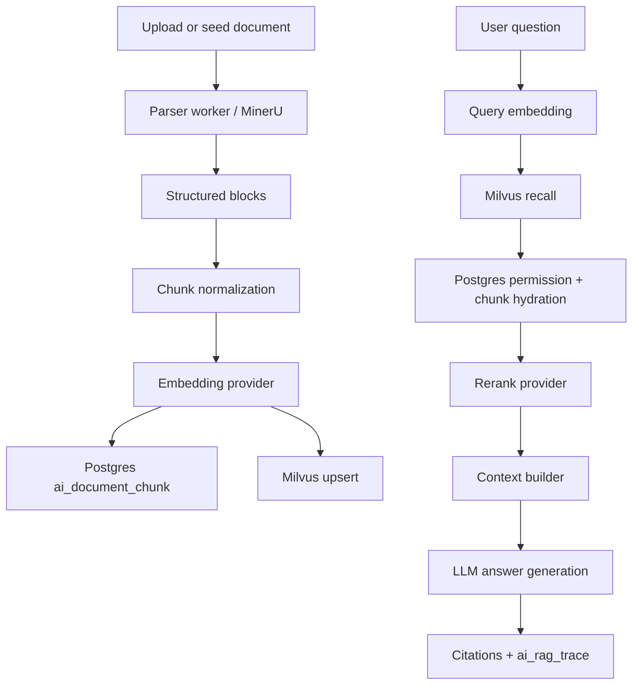

# Real RAG E2E Design

## Goal

Close the highest-risk gap in `docs/ARCHITECTURE.md`: make Novex's knowledge flow a real RAG path instead of a mostly deterministic POC path.

The approved scope is "real RAG first". This milestone must prove:

1. A parsed document can become indexed chunks.
2. Embeddings are generated through the configured embedding provider.
3. Chunks are written to and retrieved from Milvus.
4. Retrieval candidates are reranked through the configured reranker.
5. The final answer is generated by the configured LLM, with citations and a persisted RAG trace.
6. A live smoke test can run against the user's configured MinerU, embedding, rerank, LLM, and Milvus endpoints.

## Current Gap

The current backend has solid foundation slices, but the RAG ask path still stops short of the architecture target:

- `KnowledgeService::ask_dataset` performs recall and rerank, then builds an extractive answer locally.
- Live model/provider configuration is available through `novex-model`, but the answer step does not require LLM generation.
- Milvus integration exists, but local fallbacks make it hard to prove the live vector path was used.
- Parser-worker has MinerU/native parsing support, but no single end-to-end acceptance test proves `parse -> chunk -> embed -> Milvus -> retrieve -> rerank -> LLM answer`.
- Eval can score deterministic prompt-derived answers, but it does not yet provide a live RAG smoke mode.

## Architecture

The target pipeline is:

The backend remains the orchestrator. `novex-model` owns provider calls for embeddings, rerank, and chat completion. `novex-rag` owns retrieval-domain types. Milvus remains the vector store. PostgreSQL remains the source of truth for dataset, document, chunk, tenant, and trace metadata.

## Backend Changes

### Environment Loading

Backend commands and tests should load `.env` consistently. The implementation should call `dotenvy::dotenv()` during runtime config bootstrap, without logging secret values.

Live tests should load the original `/path/to/Novex/.env` through the shell environment. The secret file should not be copied into the worktree.

### RAG Ask

`KnowledgeService::ask_dataset` should:

- keep the current dataset, permission, chunk hydration, retrieval, rerank, citation, and trace semantics;
- replace local extractive answer generation with an LLM call when chat runtime config is available;
- send the question and selected context chunks to the model with a grounded-answer prompt;
- require citations to come from retrieved chunks, not from model-invented source ids;
- persist trace metadata for route/model, retrieval source, rerank source, answer source, citations, and provider usage where available;
- keep a typed fallback only for non-live/dev modes where no LLM route is configured.

### Milvus Strictness

The normal app may continue to have developer fallbacks, but live acceptance must expose a strict mode. In strict mode:

- missing Milvus config fails the test;
- Milvus upsert failure fails the test;
- Milvus recall failure fails the test;
- rerank provider failure fails the test;
- LLM provider failure fails the test.

This prevents the acceptance test from accidentally passing on local deterministic behavior.

### Live RAG Smoke

Add a gated test or smoke command that runs only when explicitly enabled, for example:

- `NOVEX_LIVE_RAG_TEST=1`
- `NOVEX_REQUIRE_MILVUS=1`
- model and MinerU env vars loaded from `.env`

The smoke should create a small isolated tenant/dataset/document fixture, index real chunks, ask a question, assert citations exist, assert the answer is not the deterministic extractive fallback, and assert trace metadata records live provider usage.

## Parser Worker

Parser-worker should remain independently testable. The live RAG smoke can use either:

1. a minimal real document fixture sent through MinerU when `MINERU_TOKEN` is available; or
2. a parser-worker endpoint/CLI mode that returns real parsed blocks and then lets backend ingestion index them.

If MinerU is unavailable or returns a provider error, the live smoke should fail only when `NOVEX_LIVE_RAG_TEST=1`; normal unit tests should remain offline and deterministic.

## Evaluation

Eval should gain a live RAG mode that executes the actual ask path and records:

- answer text;
- cited chunk ids;
- retrieval count;
- rerank route/model;
- LLM route/model;
- failure reason when a live dependency is unavailable.

Offline eval behavior should remain deterministic.

## Non-Goals

This milestone does not attempt to finish all remaining architecture gaps:

- no full `ai_app` / `ai_app_release` governance model;
- no complete MCP marketplace;
- no Agent runtime tool marketplace completion;
- no connector sync job framework;
- no delivery-template packaging completion.

Those should be separate milestones after the RAG acceptance path is genuinely live.

## Acceptance Criteria

- `cargo test --workspace --exclude backend` passes.
- `cargo test -p backend application::ai` passes.
- parser-worker unit tests pass.
- A live RAG test, run with real env loaded from `.env`, proves:
  - embedding provider was called;
  - Milvus upsert and recall were used;
  - rerank provider was called;
  - LLM provider generated the final answer;
  - citations are returned;
  - `ai_rag_trace` contains live-path metadata.
