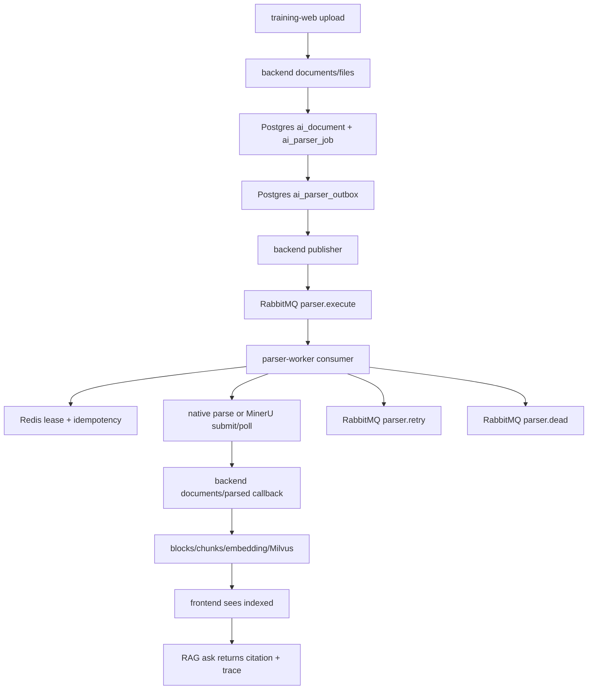

# Parser Queue Design

## Goal

Complete the document upload -> parse -> index -> ask flow with a durable, maintainable runtime architecture. Uploading a knowledge file should enqueue parsing automatically, parser workers should process jobs through RabbitMQ, Redis should protect short-lived execution state, and users should be able to ask against the uploaded document after indexing finishes.

## Current Gap

The backend already has upload, parse-job, parsed-document callback, chunk persistence, embeddings, Milvus upsert, and RAG ask APIs. The missing part is the runtime bridge:

- `documents/files` creates a parse job but does not enqueue or execute it.
- `parser-worker` can parse and callback, but it is currently a CLI/function boundary, not a durable consumer.
- PDF/MinerU submitted jobs require a later poll, but no worker loop owns that follow-up.
- Frontend upload shows "parse job created" but does not track `queued -> parsing -> indexed`.
- Tests cover segments, not the full upload-to-ask path.

## Architecture

The approved long-term architecture uses:

- PostgreSQL as source of truth for documents, parser jobs, chunks, traces, and a transactional outbox.
- RabbitMQ for durable parser job delivery, retry delay, and dead-letter queues.
- Redis for short-lived leases, idempotency keys, retry/backoff counters, and worker heartbeat/status cache.
- Rust backend as control plane and outbox publisher.
- Python parser-worker as a long-running RabbitMQ consumer that calls existing parser functions and backend callbacks.



## Backend Design

### Transactional Outbox

Add `ai_parser_outbox` with `id`, `tenant_id`, `dataset_id`, `document_id`, `parser_job_id`, `event_type`, `payload`, `status`, `attempt_count`, `last_error`, `published_time`, and audit timestamps.

`create_document_parse_job` must insert the document, parser job, dataset count update, and outbox row in one transaction. This avoids a split-brain state where the database commit succeeds but RabbitMQ publish fails.

### Publisher Runtime

Add a parser queue runtime that:

- polls pending outbox rows in small batches;
- publishes `ParserJobMessage` to RabbitMQ with persistent JSON payload;
- marks outbox rows as published only after RabbitMQ confirms ack;
- leaves failed publishes pending with `attempt_count` and `last_error`.

The runtime should be controlled by env flags so local tests can run without RabbitMQ:

- `PARSER_QUEUE_ENABLED`
- `PARSER_QUEUE_PUBLISHER_ENABLED`
- `PARSER_QUEUE_TICK_SECONDS`
- `PARSER_QUEUE_BATCH_SIZE`
- `RABBITMQ_PARSER_*`
- `REDIS_URL`

### Parser Job Status

The existing `documents/parsed` endpoint remains the only success ingestion path. The status endpoint remains for `submitted` and `failed` parser states. Add queue-visible statuses in summaries and response labels without breaking current numeric status contracts.

## RabbitMQ Design

Use a dedicated direct exchange and three durable queues:

- exchange: `novex.parser`
- execute queue: `novex.parser.execute`, routing key `parser.execute`
- retry queue: `novex.parser.retry`, routing key `parser.retry`, with TTL and dead-letter back to execute
- dead queue: `novex.parser.dead`, routing key `parser.dead`

Messages are JSON:

```json
{
  "outboxId": 1,
  "tenantId": 1,
  "datasetId": 7,
  "documentId": 42,
  "parserJobId": 99,
  "attempt": 0,
  "maxAttempts": 5,
  "parserRequest": {}
}
```

## Redis Design

Parser workers use Redis for runtime coordination:

- `novex:parser:lease:{parserJobId}` with TTL to avoid duplicate execution.
- `novex:parser:idempotency:{parserJobId}:{sourceHash}` to avoid duplicate callbacks.
- `novex:parser:heartbeat:{workerId}` for operational visibility.
- `novex:parser:retry:{parserJobId}` for retry counters and backoff hints.

If Redis is unavailable, the worker should fail the message retryably. This keeps coordination strict in queued mode.

## Parser Worker Design

Add a long-running worker entry point:

```bash
PYTHONPATH=services/parser-worker uv run --no-project --with-requirements services/parser-worker/requirements.txt python -m parser_worker.worker
```

The worker:

1. connects to RabbitMQ and Redis;
2. consumes execute messages;
3. acquires a Redis lease;
4. runs existing `execute_parse_job`;
5. posts success to `documents/parsed`;
6. routes MinerU `submitted` tasks to retry;
7. polls completed MinerU tasks on retry using `complete_mineru_parse_job`;
8. acknowledges RabbitMQ only after backend callback succeeds;
9. publishes retry/dead when attempts are exhausted.

## Frontend Design

training-web should poll the returned parse job:

- after upload, show queued/parsing/indexed/failed status;
- refresh dataset/document counters after indexed;
- allow ask immediately after indexed;
- keep fallback behavior only for demo API failure, not as a substitute for indexed status.

## Testing Strategy

Use TDD and keep normal tests offline:

- Rust unit tests for outbox row creation, parser message serialization, RabbitMQ topology config, config parsing, and publisher state transitions.
- Python unit tests for worker message handling, Redis lease behavior with fakes, retry/dead routing, and MinerU submitted follow-up.
- Frontend unit tests for upload polling and indexed status display.
- A local integration-style backend test for text upload -> parsed callback -> ask with local fallback.
- A gated live smoke for RabbitMQ/Redis/Milvus/MinerU/model providers when env vars are configured.

## Acceptance Criteria

- Uploading a Markdown/TXT knowledge file creates a parse job and outbox row in one database transaction.
- Backend publisher publishes outbox rows to RabbitMQ and marks them published only after confirmation.
- parser-worker consumes execute messages and callbacks parsed documents without manual stdin execution.
- Redis leases prevent duplicate worker execution.
- Retry and dead-letter behavior is covered by tests.
- training-web polls parse job status and shows indexed before ask.
- `docker-compose` includes RabbitMQ, Redis, parser-worker, and required env wiring.
- Relevant backend, worker, and frontend tests pass.
