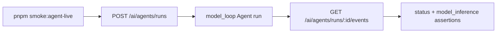

# Agent POC Live Smoke Design

## Goal

Make the Codex-style POC prove a real configured-model Agent loop with a repeatable command. The command should create an Agent run through the same backend API used by the POC, wait for events, and fail unless the run produces model-inference evidence and reaches an acceptable terminal state.

## Current State

The POC can submit `runtimeMode=model_loop` and optionally pass `modelRouteId` from `NEXT_PUBLIC_AGENT_MODEL_ROUTE_ID`. Backend events already include model inference spans with route/provider/model/usage data. The missing piece is an operator-facing smoke command that exercises this path against a running backend and a configured provider, instead of relying on a manual browser click.

## Selected Approach

Add a small Node ESM smoke runner under `apps/codex-app-poc/scripts/agent-live-smoke.mjs`.

- It is gated by `NOVEX_LIVE_AGENT_SMOKE=1`.
- It reads `NEXT_PUBLIC_API_BASE_URL`, `NEXT_PUBLIC_AGENT_MODEL_ROUTE_ID`, and optional `NOVEX_AGENT_SMOKE_TOKEN`.
- It posts to `/ai/agents/runs` with `runtimeMode=model_loop`, `autoApprove=false`, a bounded budget, and optional `modelRouteId`.
- It polls `/ai/agents/runs/:runId/events` until terminal status or timeout.
- It asserts at least one `model_inference` event is present.
- When a route id was requested, it asserts the model inference route matches it.
- It exits nonzero with a clear error when the backend, auth, provider route, or model loop is not actually working.

## Data Flow

## Error Handling

- If `NOVEX_LIVE_AGENT_SMOKE` is not `1`, the command exits 0 with a skip message.
- If the backend returns non-`200` envelope codes, the command throws the backend message.
- If the run reaches `failed` without a model inference event, the command fails.
- If timeout is reached before terminal status, the command fails and prints the last observed status.

## Acceptance

- The smoke runner request body uses the same configured-model contract as the POC composer.
- Tests cover skip gating, request construction, route-id trimming, polling completion, timeout, and route mismatch failure.
- README and migration matrix document the live command as the acceptance gate for provider-env-backed POC runs.
