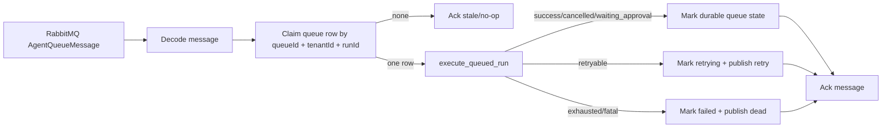

# Agent Queue Broker Consumer Design

**Date:** 2026-06-17

## Goal

Move Agent queued execution from polling-only toward broker-assisted execution by adding a RabbitMQ execute consumer that treats Postgres `ai_agent_run_queue` as the durable source of truth.

## Current State

- `AgentRabbitMqClient` can declare the Agent topology and publish execute/retry/dead messages.
- `run_agent_queue_worker` polls Postgres and executes claimed rows.
- `create_queued_run` writes `ai_agent_run_queue`, but does not publish a broker wake-up yet.
- Queue cancellation and approval resume already update the durable queue row.

## Target In This Slice

- Add a RabbitMQ consumer for `novex.agent.execute`.
- Decode `AgentQueueMessage`.
- Claim exactly the durable queue row referenced by `queueId`, `tenantId`, and `runId`.
- Treat stale or already-claimed messages as no-op acks.
- Reuse the existing queued run execution path.
- Mark terminal queue state in Postgres after execution.
- Publish retry/dead messages from execution outcomes.
- Keep the polling worker as fallback and lease recovery.

## Non-Goals

- Do not add Agent queue outbox publishing yet.
- Do not require RabbitMQ for the existing polling worker.
- Do not remove Postgres claim/lease semantics.
- Do not implement cross-process provider abort in this slice.

## Broker Consumer Contract

## Reliability Notes

- Postgres claim is the concurrency gate. RabbitMQ duplicate delivery cannot execute the same row twice because `FOR UPDATE SKIP LOCKED` and `queue_status` guard the row.
- The consumer acks after durable queue mutation and retry/dead publish attempts.
- If broker consumer is disabled or unavailable, polling continues to recover pending and retrying rows.
- Retry TTL remains in RabbitMQ topology, while Postgres retains attempt count and final status.

## Remaining After This Slice

- Durable Agent queue outbox and publisher integration.
- Publishing wake-up messages from `create_queued_run` and `resume_run` via outbox.
- Integration test with local RabbitMQ and Postgres.
- Cross-process cancellation of in-flight provider calls.
