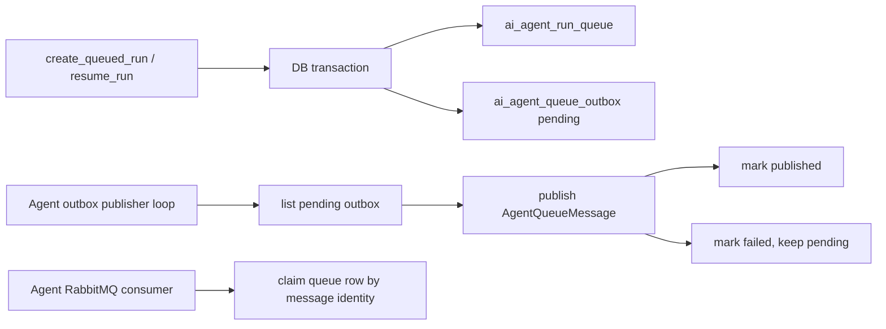

# Agent Queue Outbox Publisher Design

**Date:** 2026-06-17

## Goal

Make Agent queue wake-up delivery durable by adding an Agent-specific Postgres outbox and publisher loop that emits `AgentQueueMessage` to RabbitMQ.

## Current State

- `executionMode=queued` writes `ai_agent_run_queue`.
- Agent polling worker can claim and execute pending queue rows.
- Agent RabbitMQ topology, execute publisher, retry/dead publishers, and execute consumer are implemented.
- `create_queued_run` and queued `resume_run` do not reliably publish wake-up messages yet.

## Target In This Slice

- Add `ai_agent_queue_outbox`.
- Write outbox rows when:
  - a queued Agent run is created,
  - a waiting-approval queued Agent run is resumed.
- Add repository APIs to list pending outbox rows and mark published/failed.
- Add runtime APIs to convert outbox rows into `AgentQueueMessage` and publish them through `AgentQueueMessagePublisher`.
- Add a config-gated outbox publisher loop started by `main`.
- Keep polling worker and broker consumer unchanged as execution safety nets.

## Data Model

`ai_agent_queue_outbox` stores one durable publish intent per queue row and event type.

Important fields:

- `queue_id`, `tenant_id`, `run_id`: identity used by broker consumer to claim the durable queue row.
- `event_type`: message event, such as `agent.run.queued` or `agent.run.resumed`.
- `max_attempts`: copied from the queue row for message metadata.
- `payload`: source metadata and optional future routing context.
- `status`: `1=pending`, `2=published`.
- `attempt_count`, `last_error`, `published_time`: delivery audit and retry visibility.

## Flow

## Reliability Notes

- The queue row and outbox row are written in one repository transaction for each queued creation/resume publish intent.
- Publishing is at-least-once. Duplicate broker messages are safe because the consumer claims `ai_agent_run_queue` by exact queue/tenant/run identity.
- Publish failures keep the outbox row pending and increment `attempt_count`.
- The polling worker remains available when RabbitMQ is unavailable.

## Non-Goals

- No live RabbitMQ/Postgres integration test in this slice.
- No provider-native cross-process abort.
- No outbox sharding, rate limiting, or stuck-publishing lease state yet.

## Remaining After This Slice

- End-to-end POC run with local RabbitMQ and Postgres using configured model routes.
- Stronger outbox publisher concurrency controls if multiple backend publishers run.
- Cross-process cancellation of in-flight provider calls.
