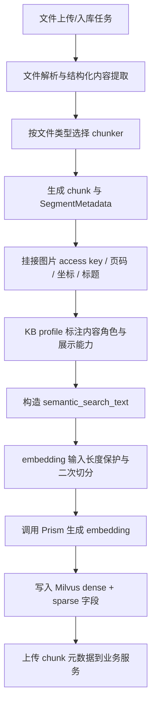
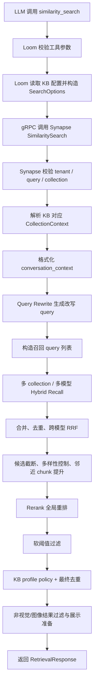

# RAG 精度提升链路：算法、流程与工具梳理

最后核查日期：2026-06-05

本文档基于当前仓库源码整理，重点回答“这个项目如何提高 RAG 精度”。范围覆盖 `loom`、`synapse`、`prism` 三个核心服务，以及入库、召回、融合、重排、工具调用、配置和当前未接入能力。

## 1. 总览

### 1.1 结论

当前项目提升 RAG 精度的主线不是单一算法，而是一条多阶段链路：

1. 入库阶段尽量把文档切成可检索、可定位、可展示的片段。
2. 为每个片段构造更适合搜索的 `semantic_search_text`，降低噪声内容进入索引的概率。
3. 检索阶段固定走 Hybrid Search，即 dense vector + BM25 sparse 双通道召回。
4. 多查询、多知识库、多 embedding 模型的候选统一合并，并通过 RRF、去重、候选多样性控制降低召回偏差。
5. 使用 rerank 服务做全局重排，最终相关性分数以 reranker 分数为准。
6. 使用 KB profile、非视觉过滤、邻近 chunk 提升、软阈值等规则修正模型和召回的边界问题。
7. `loom` 把检索能力暴露给 LLM 的 `similarity_search` 工具，并配合提示词约束“必须基于证据回答”。

### 1.2 当前实际启用的核心能力

| 类型 | 当前状态 | 主要源码 |
| --- | --- | --- |
| Hybrid Search | 已启用，且查询引擎要求必须配置为 `hybrid` | `synapse/src/service/query.rs` |
| Vector Search | 已启用，Milvus dense embedding 检索 | `synapse/src/storage/vector_store.rs` |
| BM25 Sparse Search | 已启用，Milvus sparse/BM25 检索 | `synapse/src/storage/vector_store.rs` |
| Query Rewrite | 已启用，保守改写，失败则回退原 query | `synapse/src/service/query_rewrite_client.rs` |
| Rerank | 已启用，查询主路径要求 rerank service 和配置都存在 | `synapse/src/service/query.rs`, `synapse/src/ingestion/rerank_client.rs` |
| 多知识库检索 | 已启用，按 KB 路由解析到 Milvus collection | `synapse/src/service/collection_router.rs` |
| 多 embedding 模型融合 | 已启用，跨模型结果使用 RRF | `synapse/src/service/query.rs` |
| KB profile 规则 | 已启用，用于元数据标注、重排修正、展示过滤 | `synapse/src/retrieval/kb_search_profile.rs` |
| 图文/多模态结果处理 | 已启用，支持图片 access key、坐标、页面信息、预签名 URL | `synapse/src/ingestion/worker.rs`, `synapse/src/grpc/retrieval.rs` |
| Parent-child / Hierarchical RAG | 代码预留或历史实现，当前默认未接入主流程 | `synapse/src/ingestion/chunker/mod.rs`, `synapse/src/service/bak/hierarchical_query.rs` |

## 2. 系统边界与服务分工

### 2.1 Loom：LLM 工具层

`loom` 的职责是把 RAG 检索包装为 MCP 工具，供 LLM 在回答时调用。

关键点：

- `similarity_search` 是对外暴露的检索工具。
- 工具输入包含 `collection_names`、`query`、可选 `min_score`。
- `loom` 根据请求上下文解析用户可访问的知识库 ID，并向业务服务读取 KB 配置。
- `loom` 不自己做 query rewrite，源码明确注释“Query rewriting is now handled by Synapse service”。
- 工具调用后，`loom` 把 Synapse 返回结果整理为 JSON 和 Reference，供回答侧引用。

关键源码：

- `loom/src/mcp/retrieval_server.rs`
- `loom/src/service/retrieval.rs`
- `loom/config/prompts.yaml`

精度作用：

1. 限制工具 schema，让模型只能提交知识库名和 query，避免直接操控底层检索策略。
2. 通过提示词要求技术问题、知识库问题优先调用 `similarity_search`。
3. 对多模态问题，提示词会先生成更适合检索的图文问题集合。
4. 对答案生成，提示词约束“没有证据就不要硬答”，减少幻觉。

### 2.2 Synapse：RAG 检索与索引核心

`synapse` 是真正的 RAG 引擎，负责：

- 文件解析后的 chunk 构造。
- chunk 元数据、图片 access key、坐标、页码等信息整理。
- embedding 生成和向量库写入。
- collection 路由和 schema 识别。
- query rewrite、hybrid recall、RRF、rerank、最终过滤。
- gRPC `SimilaritySearch` 服务。

关键源码：

- 入库：`synapse/src/ingestion/worker.rs`
- chunker：`synapse/src/ingestion/chunker/`
- 查询：`synapse/src/service/query.rs`
- 向量存储：`synapse/src/storage/vector_store.rs`
- gRPC：`synapse/src/grpc/retrieval.rs`

### 2.3 Prism：模型网关

`prism` 负责把 embedding、rerank、query rewrite 等模型能力统一代理到具体 provider。

关键源码：

- `prism/src/services/provider.rs`
- `prism/src/providers/openai_like.rs`

精度作用：

1. 让 Synapse 不绑定具体模型厂商。
2. 支持 embedding 和 rerank provider 的统一请求、错误处理和响应解析。
3. Rerank endpoint 采用 `/v1/rerank` 兼容接口，返回 `relevance_score` 和原始文档 index。

### 2.4 Milvus：向量与稀疏检索存储

Milvus 同时承担：

- dense vector 检索，字段一般为 `embedding`。
- sparse/BM25 检索，字段一般为 `sparse`。
- metadata 字段过滤，例如 tenant、kb、document、segment。

关键源码：

- `synapse/src/storage/vector_store.rs`
- `synapse/src/storage/collection_schema.rs`

精度作用：

1. 支持向量语义召回和关键词召回同时存在。
2. 通过 tenant/kb 过滤防止跨租户、跨知识库污染。
3. 通过 schema-aware 写入兼容新旧 collection。

### 2.5 Innies Biz / KB 路由服务

业务侧服务保存知识库和 collection 路由配置。

关键源码：

- `synapse/src/service/kb_route_client.rs`
- `synapse/src/service/collection_router.rs`

精度作用：

1. 每个 KB 可以解析到 active collection、shadow collection、embedding model、top_k、threshold 等配置。
2. 支持知识库 embedding 迁移时按 active collection 查询。
3. 支持多 KB 同时查询时跳过缺失 KB，而不是直接让整次检索失败。

## 3. 端到端流程

### 3.1 入库流程



关键源码：

- `synapse/src/ingestion/worker.rs`
- `synapse/src/ingestion/chunker/mod.rs`
- `synapse/src/ingestion/segment.rs`
- `synapse/src/ingestion/chunk_size_guard.rs`
- `synapse/src/retrieval/kb_search_profile.rs`

精度收益：

1. chunk 不只是文本，还带 page、坐标、segment index、图片 access key、标题等上下文。
2. embedding 前会用 `semantic_search_text` 清洗和增强输入，避免把无意义图片占位符、LaTeX 噪声、UUID 等当成主语义。
3. 表格、PDF、普通文本走不同 chunker，减少统一切分导致的表头丢失、章节断裂。
4. 写入 Milvus 时同时保留 `embeddedText`，用于 BM25 sparse 索引。

### 3.2 检索流程



关键源码：

- `loom/src/mcp/retrieval_server.rs`
- `loom/src/service/retrieval.rs`
- `synapse/src/grpc/retrieval.rs`
- `synapse/src/service/query.rs`
- `synapse/src/storage/vector_store.rs`

精度收益：

1. 查询侧使用会话上下文改写追问，减少“这个”“上面那个”这类省略造成的召回失败。
2. 同时使用原 query、改写 query、保守变体 query，提升召回覆盖。
3. 每个 KB 使用自己的 collection、top_k、embedding model 配置。
4. Rerank 在所有候选合并后执行，避免每个 collection 局部重排造成全局最优结果丢失。

## 4. 入库侧精度算法

### 4.1 文件类型驱动的 chunker 选择

当前 chunker factory 根据文件类型选择策略：

| 文件类型 | 当前 chunker | 精度目的 |
| --- | --- | --- |
| `xlsx` / `xls` / `csv` | `NaiveTableChunker` 或 context-aware table chunker | 保留表头和行上下文 |
| `pdf` / `doc` / `docx` / `ppt` / `pptx` | `PdfStructureChunker` | 按 PDF/文档结构、页、标题、表格线索切分 |
| `html` / `txt` / `md` / 其他 | `SemanticTextChunker` | 普通文本按句子和长度切分 |

源码位置：

- `synapse/src/ingestion/chunker/mod.rs`

注意：

- 当前 `ChunkingStrategy` 实际只保留 `Default`。
- `ParentChild`、`Hierarchical`、`TocBased`、`SlidingWindow`、`LengthBased` 等模块在 `mod.rs` 里被注释，默认主流程没有启用。

### 4.2 PDF 结构 chunking

`PdfStructureChunker` 通过结构启发式提高 chunk 质量。

主要策略：

1. 识别章节标题、结构化 label、正文解释段。
2. 尝试把标题或结构化 label 后面的解释正文吸收到同一 chunk。
3. 对同页重复或重叠内容做去重。
4. 保留 page、坐标、source index 等 metadata，方便后续引用定位和图片挂接。
5. 对表格内容委托 table chunker 处理，避免把表格直接按普通文本切碎。

源码位置：

- `synapse/src/ingestion/chunker/pdf_structure_chunker.rs`

精度收益：

- 标题和解释正文更可能在同一 chunk 中，减少“召回到了标题但没有正文”的情况。
- page 和坐标能让最终答案定位到原文页，而不仅是泛泛引用。

### 4.3 表格 chunking

`NaiveTableChunker` 处理表格时优先保留表头。

主要策略：

1. 如果整张表在大小限制内，整表作为一个 chunk。
2. 如果超过限制，按行分块。
3. 每个行块尽量携带表头。
4. 如果单行过大，再按列或内容进一步拆。
5. 保留表格 metadata，让检索结果知道自己是 table segment。

源码位置：

- `synapse/src/ingestion/chunker/naive_table_chunker.rs`

精度收益：

- 表格问题通常依赖列名和行值同时出现。保留表头能显著降低“只召回值但不知道含义”的问题。

### 4.4 普通文本 chunking

`SemanticTextChunker` 名称上是语义切分，但当前源码注释显示完整的 embedding similarity 语义切分尚未实现，实际主要按句子边界和长度做 fallback 切分。

主要策略：

1. 优先把文本拆成句子。
2. 按最大 chunk 大小合并句子。
3. 超长句子再按长度切分。
4. 从 source metadata 回填 page、坐标、source title 等信息。

源码位置：

- `synapse/src/ingestion/chunker/semantic_text_chunker.rs`

注意：

- 配置文件里也标注 `SemanticTextChunker` 当前未完整实现。
- 所以不要把当前系统描述成已经有成熟的 embedding-based semantic chunking。

### 4.5 embedding 输入长度保护

入库时不是直接把 chunk 送去 embedding，而是先做长度保护。

主要策略：

1. 对每个 chunk 生成 `semantic_search_text`。
2. 使用 `split_for_embedding_limit` 检查是否超过 embedding 最大 token/长度限制。
3. 如果超过限制，按文本或表格规则二次拆分。
4. 拆分后重新编号，保证 chunk 数和 embedding 数一致。

源码位置：

- `synapse/src/ingestion/worker.rs`
- `synapse/src/ingestion/chunk_size_guard.rs`

精度收益：

- 避免 embedding provider 截断长文本，减少关键信息被模型端静默丢失。
- 超长表格或段落仍可进入索引，而不是失败或被整体裁掉。

### 4.6 `semantic_search_text` 构造

项目不是简单用 chunk 原文做 embedding/BM25 文本，而是构造专门的检索文本。

主要策略：

1. 去除 LaTeX 噪声，例如 `\succ`、`\frac` 之类符号。
2. 去除低价值 fallback image caption。
3. 对纯图片 fallback 内容，优先使用图片 anchor text、source title、document title、file name。
4. 对 table/image segment，保留 caption 和上下文。
5. 跳过 UUID-like 的 search hint，避免检索被无意义 ID 干扰。

源码位置：

- `synapse/src/ingestion/segment.rs`

精度收益：

- embedding 和 BM25 的输入更接近用户会问的语义。
- 图片和表格不会因为原始内容为空或只有占位符而完全不可检索。

### 4.7 图片 access key 与视觉上下文

入库 worker 会把解析出的图片 key 挂接到 chunk 上。

主要策略：

1. 根据 source index 关联图片和文本 chunk。
2. 支持显式 primary image link。
3. 将 `image_access_keys` 写入 metadata。
4. 检索返回时生成预签名 URL，供前端或回答侧展示。

源码位置：

- `synapse/src/ingestion/worker.rs`
- `synapse/src/grpc/retrieval.rs`

精度收益：

- 多模态问答可以返回图像证据，而不是只返回 OCR 文本。
- 页面定位、图片定位和文本引用可以组合使用。

### 4.8 KB profile 入库标注

`kb_search_profile` 会在入库阶段给 chunk 标注内容角色和展示能力。

内容角色：

- `Canonical`：更像权威正文或标准内容。
- `SummaryFaq`：摘要、FAQ、泛化问答。
- `TestCase`：测试用例、评测样例、示例类内容。

展示能力：

- `PreciseAnchor`：能精确定位。
- `RowOnly`：只有行级内容。
- `TextOnly`：仅文本展示。

源码位置：

- `synapse/src/retrieval/kb_search_profile.rs`

精度收益：

- 后续检索可以提升权威正文，压低 FAQ、测试样例和引用表格行，避免“看起来相似但不是答案来源”的内容排到前面。

## 5. 查询侧精度算法

### 5.1 查询模式强制为 Hybrid

当前 `QueryEngine` 的主路径要求：

1. `hybrid_search` 配置必须存在。
2. `search_mode` 必须为 `hybrid`。
3. `rerank_config` 必须存在且 enabled。
4. `rerank_service` 必须存在。

源码位置：

- `synapse/src/service/query.rs`

精度含义：

- 项目当前不再依赖纯 vector 检索。
- BM25 和 vector 共同参与召回。
- Rerank 是查询质量链路的必需阶段，而不是可有可无的后处理。

### 5.2 Query Rewrite

Query rewrite 的目标是把用户问题改写成更适合检索的独立问题，尤其处理带上下文的追问。

主要策略：

1. 有 `conversation_context` 时使用上下文感知改写。
2. 无上下文时使用基础 rewrite。
3. 对模型输出做清洗：去除常见前缀、零宽字符、控制字符、prompt injection 标记。
4. 验证改写是否为空、过长、多行、语义漂移。
5. 失败时回退原 query。
6. 对“这个、那个、上面、刚才”等追问模式，更倾向使用 rewritten query 做 rerank query。

源码位置：

- `synapse/src/service/query_rewrite_client.rs`
- `synapse/src/service/query.rs`

关键限制：

- 原 query 最大长度约束。
- conversation context 最大长度约束。
- prompt 最大长度约束。
- 改写结果有长度比例限制，避免模型扩写过度。

精度收益：

- 提高指代、省略、上下文依赖问题的召回率。
- 通过验证避免 rewrite 把问题改偏。

### 5.3 多召回 query 构造

检索不是只用一个 query。`build_recall_queries` 会构造召回 query 集合：

1. 原始 query。
2. rewritten query。
3. 保守 recall variants，例如轻量关键词替换、标点归一化等。

源码位置：

- `synapse/src/service/query.rs`
- `synapse/src/service/query_rewrite_client.rs`

精度收益：

- 原 query 保证不丢用户原意。
- rewritten query 解决上下文指代。
- conservative variants 解决术语、标点、中文表达差异。

### 5.4 Dense vector 检索

Vector search 使用 embedding 语义召回。

主要策略：

1. 对每个 recall query 生成 embedding。
2. 对每个目标 collection 执行 vector search。
3. 使用 tenant/kb filter 限制检索范围。
4. Milvus 使用 COSINE 距离/相似度。
5. 查询时设置 `nprobe = 128` 提高召回质量。

源码位置：

- `synapse/src/service/query.rs`
- `synapse/src/storage/vector_store.rs`

分数归一化：

```text
normalized_vector_score = (raw_cosine_score + 1) / 2
```

精度收益：

- 处理同义表达、概念相似、自然语言问法。
- 对非精确关键词问题比 BM25 更稳。

### 5.5 BM25 sparse 检索

BM25 sparse search 使用关键词召回。

主要策略：

1. 写入时将 `embeddedText` 用作 BM25 sparse 文本。
2. 查询时在 Milvus sparse 字段上执行 BM25。
3. tokenizer 支持 CJK 字符 token。
4. tokenizer 保留技术符号，例如 `.`, `-`, `_`, `+`, `#`。
5. 特别保留 `C#`、`C++`、`Node.js`、`GPT-4` 这类技术词形。

源码位置：

- `synapse/src/storage/vector_store.rs`

分数归一化：

```text
normalized_bm25_score = 2 / pi * atan(scale * raw_bm25_score)
scale = 1 / max_abs_bm25_score
```

这个设计让当前 batch 内最高 BM25 分数大约归一到 0.5 附近，避免 BM25 原始分数量纲过大压倒向量分数。

精度收益：

- 对实体名、编号、错误码、专有名词、表格字段、API 名称更敏感。
- 弥补 vector 对精确词匹配不稳定的问题。

### 5.6 BM25 检索文本增强

BM25 search text 不只使用正文，还会加入强提示字段。

主要策略：

1. 使用 `semantic_search_text` 作为基础文本。
2. 对表格类内容，增强 `document_title`、`source_file_name`、`source_titles` 等 hint。
3. 跳过 UUID-like hint。
4. 避免把无意义 ID 变成高权重关键词。

源码位置：

- `synapse/src/storage/vector_store.rs`

精度收益：

- 表格、文件名、标题中的关键术语更容易被关键词检索召回。
- 避免随机 ID 误召回。

### 5.7 Hybrid true dual scoring

Hybrid search 会并行执行 vector search 和 BM25 search，然后合并候选。

主要步骤：

1. 对每个 collection 执行 vector search。
2. 对每个 collection 执行 BM25 search。
3. 取两路结果 union。
4. 对 vector 分数和 BM25 分数分别归一化。
5. 对 BM25-only 候选补算 vector 分。
6. 对 vector-only 候选补算本地 BM25 分。
7. 用加权公式计算 preliminary score。

源码位置：

- `synapse/src/storage/vector_store.rs`

融合公式：

```text
preliminary_score = vector_weight * vector_score + bm25_weight * bm25_score
```

默认配置：

```yaml
vector_weight: 0.5
bm25_weight: 0.5
```

注意：

- README 或历史文档中如果出现 0.7/0.3 之类权重，应以当前 `config.default.yaml` 为准。
- 当前默认是 0.5/0.5。

精度收益：

- vector-only 和 BM25-only 候选都能进入统一排序空间。
- 补算缺失分数能避免“某一路没召回就得 0”的极端偏差。

### 5.8 候选数控制

Hybrid search 的召回候选数不是只取最终 top_k。

主要配置：

```yaml
retrieval_multiplier: 2
min_retrieval_candidates: 100
max_candidates: 120
```

含义：

1. 每一路召回候选数按 top_k 放大。
2. 即使 top_k 很小，也保证最低召回候选数。
3. Rerank 前还有最大候选数控制，避免上下文和成本爆炸。

Rerank 候选上限逻辑：

```text
effective_rerank_candidate_limit =
  max(config.max_candidates, min(top_k * 8, 200))
```

源码位置：

- `synapse/src/service/query.rs`
- `synapse/config/config.default.yaml`

精度收益：

- 小 top_k 查询仍有足够候选进入 rerank。
- 控制成本，同时避免过早截断导致真正答案进不了 rerank。

### 5.9 多 collection 检索

多知识库检索时，Synapse 会把每个 KB 解析为 `CollectionContext`。

主要字段：

- `collection_name`
- `schema_type`
- `embedding_model_id`
- `tenant_id`
- `kb_id`
- `top_k`
- `threshold`
- `kb_name`

源码位置：

- `synapse/src/storage/collection_schema.rs`
- `synapse/src/service/collection_router.rs`

执行策略：

1. 一次请求可以包含多个 collection/KB。
2. 每个 KB 有自己的 top_k 和 embedding model。
3. 缺失或不可解析的 KB 会记录日志并跳过。
4. collection 查询并发执行，受 `max_parallel_collections` 限制。

精度收益：

- 多 KB 同查时仍保留各自配置。
- embedding 迁移阶段可以支持多个模型或 collection 并存。

### 5.10 跨 embedding 模型 RRF

当多个 `CollectionContext` 使用不同 embedding model 时，系统对跨模型结果做 Reciprocal Rank Fusion。

RRF 公式：

```text
rrf_contribution = 1 / (k + rank)
```

默认配置：

```yaml
cross_model_rrf_k: 60
```

源码位置：

- `synapse/src/service/query.rs`

处理步骤：

1. 按 embedding model 分组。
2. 每个模型内保留自己的排序。
3. 对同一 logical chunk 聚合不同模型的排名贡献。
4. 将 `cross_model_*` 信息写入 metadata，便于调试。

精度收益：

- embedding 迁移或多模型并存时，不让某个模型的分数尺度直接压倒其他模型。
- RRF 只依赖排名，相对稳健。

### 5.11 结果合并与去重

候选合并后会做多层去重。

主要去重逻辑：

1. 按 segment 或 logical chunk identity 去重。
2. 使用 document fingerprint、source、page、segment index 等构造稳定 key。
3. 对 KB 等价结果去重，避免同一内容在多个召回 query 中重复出现。
4. 最终输出前再按 segment 去重。

源码位置：

- `synapse/src/service/query.rs`

精度收益：

- 减少最终 top_k 被重复 chunk 占满。
- 提升答案证据的覆盖面。

### 5.12 Rerank 全局重排

Rerank 是当前查询主路径的关键质量阶段。

主要策略：

1. Hybrid recall 后统一 rerank，而不是每个 collection 单独 rerank。
2. Rerank query 会优先选择更适合排序的 query：
   - 对上下文追问，偏向 rewritten query。
   - 其他情况保留原 query。
3. Rerank 服务对上下文做长度预处理。
4. Rerank request 中 `top_k: None`，最终 top_k 由 query 层控制。
5. Rerank 结果返回 `relevance_score` 和原 document index。

源码位置：

- `synapse/src/service/query.rs`
- `synapse/src/ingestion/rerank_service.rs`
- `synapse/src/ingestion/rerank_client.rs`
- `prism/src/providers/openai_like.rs`

最终分数：

当前主路径在 materialize rerank score 时，最终 `relevance_score` 使用 reranker score，而不是 BM25/vector 融合后的分数。

```text
final_relevance_score = reranker_score
```

精度收益：

- Reranker 可以基于 query-document pair 重新判断语义相关性。
- Hybrid score 用于召回和预排序，rerank score 用于最终相关性排序。

### 5.13 Rerank 软阈值

系统有 rerank threshold，默认配置约为：

```yaml
threshold: 0.7
```

但过滤策略是“软阈值”，不是机械硬切。

主要逻辑：

1. 如果过滤后仍有足够结果，保留高于阈值的结果。
2. 如果阈值会清空全部结果，回退保留原候选。
3. 如果过滤后少于 `min_keep`，补回 top results。

源码位置：

- `synapse/src/service/query.rs`

精度收益：

- 避免阈值过严导致“明明有相关材料但返回空”。
- 同时保留 threshold 对低质量结果的压制作用。

### 5.14 Rerank 前候选多样性控制

进入 rerank 前，系统会做候选截断和多样性控制。

主要策略：

1. 按 KB、collection、file/source 等分组，避免同一文件占满 rerank 窗口。
2. 优先保留高分候选。
3. 在分数接近时提升相邻 chunk。
4. 邻近 chunk promotion 使用 segment index 和同文档关系。

相关常量：

```text
adjacent_chunk_margin = 0.04
rerank_candidate_multiplier = 8
rerank_candidate_cap = 200
```

源码位置：

- `synapse/src/service/query.rs`

精度收益：

- 让 reranker 看到更多来源，减少单一文档刷屏。
- 对跨 chunk 答案更友好，避免只召回片段中间的一小块。

### 5.15 KB profile policy

KB profile 在检索时会重新 enrich metadata，并对排序做轻量修正。

主要分数修正：

| 条件 | 分数调整 |
| --- | --- |
| Canonical | `+0.04` |
| SummaryFaq | `-0.02` |
| TestCase | `-0.12` |
| PreciseAnchor | `+0.10` |
| RowOnly | `-0.02` |
| synthetic header | `-0.03` |
| probable eval/test content | `-0.08` |
| precise non-reference content | `+0.02` |

此外会在小分差范围内做稳定重排，margin 约为 `0.05`。

源码位置：

- `synapse/src/retrieval/kb_search_profile.rs`

精度收益：

- 权威正文优先。
- 测试样例、FAQ、引用表格行不会轻易压过真正答案。
- 保持排序修正幅度较小，避免规则完全覆盖 reranker 判断。

### 5.16 非视觉和视觉结果过滤

gRPC 层在返回前会根据问题类型和结果类型做过滤。

主要策略：

1. 非视觉 KB 主结果中过滤低质量来源。
2. 对 target mismatch 做抑制。
3. 对 outline、inventory、timeline 等宽泛查询做不同处理。
4. 图片结果和非图片结果分开处理。
5. 明确需要视觉证据时保留图像候选。
6. 显式 top_k 且非视觉查询时，会 overfetch 供过滤后仍有足够可见结果：

```text
primary_query_top_k = max(visible_top_k * 2, visible_top_k + 4)
```

源码位置：

- `synapse/src/grpc/retrieval.rs`

精度收益：

- 降低图像占位、目录页、泛化摘要误入最终证据。
- 保证过滤后仍能返回足够结果。

## 6. 具体工具与接口

### 6.1 MCP 工具：`similarity_search`

工具定义位置：

- `loom/src/mcp/retrieval_server.rs`

输入字段：

| 字段 | 含义 | 备注 |
| --- | --- | --- |
| `collection_names` | 要搜索的知识库名称列表 | Loom 会校验和归一化 |
| `query` | 用户检索问题 | Query rewrite 在 Synapse 内做 |
| `min_score` | 可选最低分 | 只在 tool output 层过滤，不是核心召回阈值 |

输出内容：

- `id`
- `content`
- `score`
- `source`
- `metadata`
- `segment_info`
- `images`

精度作用：

- LLM 通过固定工具入口检索，避免自由发挥伪造引用。
- 可选 `min_score` 是最终工具展示层过滤，不应误认为 Synapse 的 rerank threshold。

### 6.2 gRPC 接口：RetrievalService

Proto 位置：

- `crab-api/crab-rag/v1/retrieval.proto`

核心接口：

```proto
service RetrievalService {
  rpc SimilaritySearch(SimilaritySearchRequest) returns (SimilaritySearchResponse);
}
```

请求关键字段：

- `collection_names`
- `query`
- `max_results`
- `search_options`
- `conversation_context`

响应关键字段：

- `results`
- `total_count`
- `query`

注意：

- `SearchOptions` 中 threshold 字段已 reserved。
- 当前 Loom 主要传 top_k，最终阈值由 Synapse rerank config 和工具层可选 `min_score` 分别控制。

### 6.3 Prism 模型工具

Prism 对外承担三类模型能力：

| 能力 | 用途 | 源码 |
| --- | --- | --- |
| Embedding | chunk 入库和 query embedding | `prism/src/services/provider.rs` |
| Rerank | query-document pair 重排 | `prism/src/providers/openai_like.rs` |
| Query Rewrite | 查询改写 | Synapse client 调用 Prism 侧模型 |

精度作用：

- Embedding 负责语义召回。
- Rerank 负责最终相关性判断。
- Query rewrite 负责追问和表达归一。

### 6.4 Milvus Collection Schema

项目支持两类 collection schema：

1. 新 schema：`innies_emb_*`
2. 旧 schema：`kb_*`

新 schema 典型字段：

- `tenant_id`
- `kb_id`
- `user_id`
- `document_id`
- `segment_type`
- `segment_index`
- `embedding`
- `sparse`
- `document`
- `embeddedText`

源码位置：

- `synapse/src/storage/collection_schema.rs`
- `synapse/src/storage/vector_store.rs`

精度作用：

- 新 schema 显式包含 tenant/kb/document/segment 信息，有利于过滤、定位和去重。
- `embeddedText` 同时服务 BM25 sparse。

## 7. 配置旋钮

配置主要在：

- `synapse/config/config.default.yaml`

### 7.1 Chunking 配置

| 配置 | 作用 | 精度影响 |
| --- | --- | --- |
| `chunking.strategy` | 当前默认策略 | 当前只有 Default 生效 |
| `chunking.max_chunk_size` | chunk 最大长度 | 过大影响 embedding 精度，过小丢上下文 |
| `chunking.overlap_size` | overlap 长度 | 提高跨边界召回，但会增加重复 |
| `chunking.semantic_text_chunker` | 普通文本切分配置 | 当前不是完整 embedding semantic split |
| `chunking.parent_child` | parent-child 配置 | 预留，默认未接入 |
| `chunking.toc` | TOC chunk 配置 | 预留，默认未接入 |

### 7.2 Hybrid Search 配置

| 配置 | 当前含义 |
| --- | --- |
| `search_mode` | 必须为 `hybrid` |
| `vector_weight` | vector 分数融合权重，默认 0.5 |
| `bm25_weight` | BM25 分数融合权重，默认 0.5 |
| `drop_ratio_search` | Milvus sparse search drop ratio，默认 0 |
| `retrieval_multiplier` | 根据 top_k 放大召回候选 |
| `min_retrieval_candidates` | 最低召回候选数 |
| `bm25_normalization` | BM25 归一化，当前为 arctan |
| `bm25_only_vector_fallback_factor` | BM25-only 候选补 vector 分兜底系数 |
| `vector_only_bm25_fallback_factor` | vector-only 候选补 BM25 分兜底系数 |

### 7.3 Rerank 配置

| 配置 | 当前含义 |
| --- | --- |
| `enabled` | 当前主路径要求 enabled |
| `threshold` | rerank 软阈值 |
| `max_candidates` | rerank 基础候选上限 |
| `timeout` | rerank 请求超时 |
| `max_context_length` | document context 预处理限制 |

当前流程描述：

```text
vector + BM25 recall -> fusion -> rerank -> soft threshold -> final policy
```

注意：

- 最终分数来自 rerank，不是 rerank 后再做 BM25/vector 混合。

### 7.4 Query Rewrite 配置

| 配置 | 作用 |
| --- | --- |
| `enabled` | 是否启用 query rewrite |
| `timeout` | 改写请求超时 |
| `model` / provider | 使用的改写模型 |
| prompt/context 限制 | 防止上下文过长和 prompt 注入 |

精度影响：

- 开启后提升追问召回。
- 过度 rewrite 会带来语义漂移，因此代码中有保守校验。

### 7.5 Query 配置

| 配置 | 作用 |
| --- | --- |
| `max_results` | 默认最大返回结果数 |
| `max_parallel_collections` | 多 collection 并发上限 |
| `cross_model_rrf_k` | 跨 embedding 模型 RRF 平滑常数 |
| `image_url_ttl` | 图片预签名 URL TTL |

## 8. 精度提升点逐项拆解

### 8.1 防止召回不足

项目使用以下机制防止找不到相关材料：

1. 原 query + rewritten query + conservative variants 多 query 召回。
2. vector + BM25 双通道召回。
3. top_k 放大和最低候选数。
4. 多 collection 并发搜索。
5. 多 embedding 模型 RRF 融合。
6. rerank 软阈值避免结果被阈值全部清空。
7. 显式 top_k 查询时 gRPC 层 overfetch。

### 8.2 防止召回不准

项目使用以下机制降低无关结果：

1. tenant/kb 过滤。
2. query rewrite 输出验证，防止语义漂移。
3. BM25 tokenizer 保留技术词，降低关键词漏召。
4. Hybrid 分数归一化，降低单一路分数尺度污染。
5. Rerank 全局重排。
6. KB profile 降权 FAQ、测试样例、引用表格行。
7. 非视觉/视觉结果过滤。

### 8.3 防止证据重复

项目使用以下机制减少重复：

1. logical chunk identity 去重。
2. segment 去重。
3. KB 等价结果去重。
4. Rerank 前候选多样性控制。
5. 同一文件占比控制。

### 8.4 防止答案无法落地引用

项目使用以下机制保证引用可落地：

1. chunk metadata 保留 page number、page label、coordinates。
2. 图片 access key 挂接 chunk。
3. gRPC response 包含 `SegmentInfo`。
4. 返回图片预签名 URL。
5. tool output 生成 Reference。
6. prompt 约束必须基于检索证据回答。

## 9. 当前未真正接入或容易误读的能力

### 9.1 Parent-child chunking 未在主流程启用

源码里 parent-child、hierarchical、TOC、sliding-window 模块存在历史或预留痕迹，但当前 `chunker/mod.rs` 中相关模块被注释，`ChunkingStrategy` 只保留 `Default`。

影响：

- 当前不能把系统描述成已经生产启用了 parent-child RAG。
- 如果需要 parent-child，需要重新接入 chunker、metadata、query engine 和结果展示链路。

### 9.2 Hierarchical QueryEngine 未接入

配置文件提到 `HierarchicalQueryEngine` 已实现但未接入；源码也主要在 `service/bak` 下。

影响：

- 当前主查询路径是 `execute_hybrid_multi_collection`。
- 不应把 hierarchical retrieval 算作当前精度收益。

### 9.3 SemanticTextChunker 不是完整语义切分

`SemanticTextChunker` 的源码注释中提到真正的 embedding similarity semantic split 仍是 TODO，当前主要是句子和长度 fallback。

影响：

- 当前普通文本 chunking 的精度收益主要来自边界、长度和 metadata，而不是成熟语义相似度切分。

### 9.4 SearchOptions threshold 已 reserved

Proto 中 `SearchOptions` 的 threshold 字段已 reserved。Loom 目前会传 top_k，但不传底层 threshold。

影响：

- KB route 中存在 threshold 配置，但工具请求路径不直接通过 proto 传 threshold。
- 当前核心阈值主要是 Synapse rerank threshold。
- tool 输入里的 `min_score` 是 Loom 输出层过滤，不是底层召回阈值。

### 9.5 纯 QueryBuilder 查询路径已废弃

`QueryBuilder::execute` 当前会返回错误，提示使用 `execute_hybrid_multi_collection`。

影响：

- 如果看到旧代码或旧文档提到纯 query builder，需要按当前主路径修正理解。

## 10. 算法公式速查

### 10.1 Vector score normalization

```text
normalized_vector_score = (raw_cosine_score + 1) / 2
```

目的：

- 把 cosine 相似度映射到更容易与 BM25 混合的区间。

### 10.2 BM25 arctan normalization

```text
normalized_bm25_score = 2 / pi * atan(scale * raw_bm25_score)
scale = 1 / max_abs_bm25_score
```

目的：

- 压缩 BM25 长尾分数。
- 避免 BM25 原始分数压倒 vector 分数。

### 10.3 Hybrid preliminary score

```text
preliminary_score =
  vector_weight * normalized_vector_score
  + bm25_weight * normalized_bm25_score
```

默认：

```text
vector_weight = 0.5
bm25_weight = 0.5
```

### 10.4 RRF

```text
rrf_score = sum(1 / (k + rank_i))
```

默认：

```text
k = 60
```

目的：

- 跨模型、跨结果列表融合时减少分数尺度问题。

### 10.5 Rerank final score

```text
final_relevance_score = reranker_score
```

目的：

- 最终结果按 query-document pair 相关性排序。

### 10.6 Soft threshold

```text
if count(score >= threshold) >= min_keep:
    keep score >= threshold
else:
    keep top min_keep or original fallback
```

目的：

- 阈值过滤低质量结果，同时避免空结果。

## 11. 数据流关键字段

### 11.1 Chunk / Segment metadata

常见字段：

- `document_id`
- `document_fingerprint`
- `source_file_name`
- `document_title`
- `source_titles`
- `segment_type`
- `segment_index`
- `page_number`
- `page_label`
- `coordinates`
- `image_access_keys`
- `kb_content_role`
- `kb_display_capability`

精度作用：

- 去重使用 document/segment identity。
- 展示使用 page/coordinates/images。
- KB policy 使用 role/capability。

### 11.2 RetrievalResult

常见字段：

- `id`
- `content`
- `score`
- `source`
- `metadata`
- `segment_info`

精度作用：

- `score` 是最终排序判断。
- `metadata` 支撑二次过滤和调试。
- `segment_info` 支撑引用定位。

### 11.3 Hybrid metadata

常见字段：

- `vector_score`
- `bm25_score`
- `preliminary_score`
- `hybrid_source`
- `rerank_score`
- `cross_model_*`

精度作用：

- 便于定位结果来自 vector、BM25 还是两者共同命中。
- 便于分析 rerank 是否纠正了初排。

## 12. 排查 RAG 精度问题时应看哪里

### 12.1 召回不到

优先检查：

1. KB route 是否解析到正确 collection。
2. tenant_id / kb_id filter 是否正确。
3. `semantic_search_text` 是否为空或被清洗过度。
4. chunk 是否过大、过小或缺失表头。
5. BM25 tokenizer 是否能保留关键术语。
6. query rewrite 是否失败或改偏。
7. Milvus collection schema 是否匹配。

相关源码：

- `synapse/src/service/collection_router.rs`
- `synapse/src/storage/vector_store.rs`
- `synapse/src/ingestion/segment.rs`
- `synapse/src/service/query_rewrite_client.rs`

### 12.2 召回到了但排序低

优先检查：

1. Hybrid 初排中 vector/BM25 分数。
2. Rerank score 是否低。
3. KB profile 是否把内容降权。
4. 是否被候选截断挡在 rerank 之外。
5. 是否被非视觉/低质量过滤压掉。

相关源码：

- `synapse/src/service/query.rs`
- `synapse/src/retrieval/kb_search_profile.rs`
- `synapse/src/grpc/retrieval.rs`

### 12.3 返回重复结果

优先检查：

1. document fingerprint 是否稳定。
2. segment index 是否正确。
3. metadata 中 source/page/segment 信息是否缺失。
4. logical chunk identity key 是否能识别重复。

相关源码：

- `synapse/src/service/query.rs`
- `synapse/src/ingestion/worker.rs`

### 12.4 图像或页码引用不对

优先检查：

1. 解析阶段 metadata 是否带 page 和 coordinates。
2. `attach_image_access_keys_to_chunks` 是否挂接成功。
3. `SegmentInfo` 构造是否保留图片字段。
4. 预签名 URL 生成是否成功。

相关源码：

- `synapse/src/ingestion/worker.rs`
- `synapse/src/grpc/retrieval.rs`

## 13. 可继续优化的方向

### 13.1 接入真正的 semantic chunking

当前普通文本 chunker 不是完整 embedding-based semantic split。可以考虑：

1. 句向量相似度断点。
2. 标题层级和语义边界联合判断。
3. 对中文、代码、表格说明分别定制边界。

风险：

- embedding 成本增加。
- chunk 稳定性下降可能影响已有索引。

### 13.2 重新接入 parent-child retrieval

当前 parent-child 配置和模块未接入。可以考虑：

1. child chunk 用于精确召回。
2. parent chunk 用于回答上下文扩展。
3. 检索结果同时返回 child anchor 和 parent context。

风险：

- 需要重建索引 schema 或至少补 metadata。
- 需要处理 parent 展示和引用边界，避免答案引用过宽。

### 13.3 学习型 fusion 或动态权重

当前 vector/BM25 默认 0.5/0.5。可以考虑按 query 类型动态调整：

1. 含编号、错误码、API 名称时提高 BM25。
2. 抽象概念和自然语言问法提高 vector。
3. 表格查询单独调权。

风险：

- 需要评测集，否则容易过拟合。

### 13.4 Rerank threshold 按 KB 或 query 类型动态化

当前 rerank threshold 是全局软阈值。可以考虑：

1. 高精度 KB 使用更高阈值。
2. 召回稀疏的 KB 使用更低阈值。
3. 对“列举/概览”问题降低阈值，对“精确事实”问题提高阈值。

风险：

- 阈值策略会直接影响空结果率和幻觉率，需要线上监控。

### 13.5 建立离线评测闭环

当前代码有很多精度策略，但要持续优化需要评测集。

建议指标：

- Recall@K
- MRR
- NDCG@K
- answer groundedness
- citation accuracy
- empty result rate
- duplicate result rate
- image evidence hit rate

建议样本类型：

- 精确实体查询。
- 错误码/API 查询。
- 表格字段查询。
- 多轮追问。
- 图片证据查询。
- 同义表达查询。
- 多 KB 查询。

## 14. 源码索引

### 14.1 Loom

| 文件 | 作用 |
| --- | --- |
| `loom/src/mcp/retrieval_server.rs` | MCP `similarity_search` 工具定义、参数校验、KB 配置读取、结果输出 |
| `loom/src/service/retrieval.rs` | gRPC retrieval client 封装 |
| `loom/config/prompts.yaml` | 工具调用、图文问题生成、证据约束提示词 |

### 14.2 Synapse 查询

| 文件 | 作用 |
| --- | --- |
| `synapse/src/grpc/retrieval.rs` | gRPC `SimilaritySearch` 入口、结果过滤、图片 URL、response 构造 |
| `synapse/src/service/query.rs` | Hybrid multi-collection 主流程、query rewrite、RRF、rerank、去重、最终 policy |
| `synapse/src/service/query_rewrite_client.rs` | query rewrite client、prompt sanitization、rewrite validation |
| `synapse/src/retrieval/kb_search_profile.rs` | KB profile 标注、重排修正、展示能力判断 |
| `synapse/src/service/collection_router.rs` | KB 到 collection context 路由 |
| `synapse/src/service/kb_route_client.rs` | 调用业务侧 KB route RPC |

### 14.3 Synapse 入库

| 文件 | 作用 |
| --- | --- |
| `synapse/src/ingestion/worker.rs` | 入库主流程、图片挂接、embedding、Milvus 写入、chunk metadata 上传 |
| `synapse/src/ingestion/chunker/mod.rs` | chunker factory 和当前启用策略 |
| `synapse/src/ingestion/chunker/pdf_structure_chunker.rs` | PDF/文档结构 chunking |
| `synapse/src/ingestion/chunker/naive_table_chunker.rs` | 表格 chunking |
| `synapse/src/ingestion/chunker/semantic_text_chunker.rs` | 普通文本句子/长度切分 |
| `synapse/src/ingestion/chunk_size_guard.rs` | embedding 输入长度保护 |
| `synapse/src/ingestion/segment.rs` | Segment metadata 与 semantic search text 构造 |
| `synapse/src/ingestion/rerank_client.rs` | rerank 请求构造、上下文长度处理、Prism 调用 |
| `synapse/src/ingestion/rerank_service.rs` | rerank trait 与调用约定 |

### 14.4 Synapse 存储

| 文件 | 作用 |
| --- | --- |
| `synapse/src/storage/vector_store.rs` | Milvus 写入、vector search、BM25 search、hybrid fusion、tokenizer、本地 BM25 补分 |
| `synapse/src/storage/collection_schema.rs` | 新旧 collection schema 和 `CollectionContext` |

### 14.5 Prism

| 文件 | 作用 |
| --- | --- |
| `prism/src/services/provider.rs` | provider gateway，封装 embedding 和 rerank |
| `prism/src/providers/openai_like.rs` | OpenAI-like provider，包含 rerank endpoint 请求和响应解析 |

### 14.6 API

| 文件 | 作用 |
| --- | --- |
| `crab-api/crab-rag/v1/retrieval.proto` | Retrieval gRPC proto 定义 |

## 15. 一句话架构图

```text
LLM
  -> Loom similarity_search 工具
  -> Synapse gRPC SimilaritySearch
  -> KB route 解析 collection
  -> Query rewrite
  -> Dense vector + BM25 hybrid recall
  -> 多 query / 多 KB / 多模型合并
  -> RRF / 去重 / 候选多样性控制
  -> Prism rerank
  -> KB profile / 视觉过滤 / 软阈值
  -> 带引用、页码、图片的检索结果
  -> LLM 基于证据回答
```

